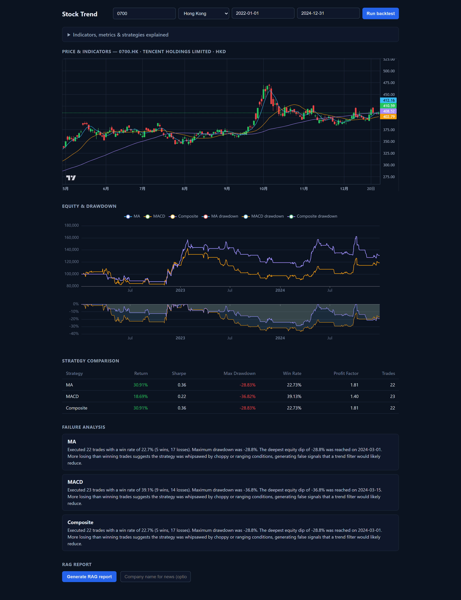
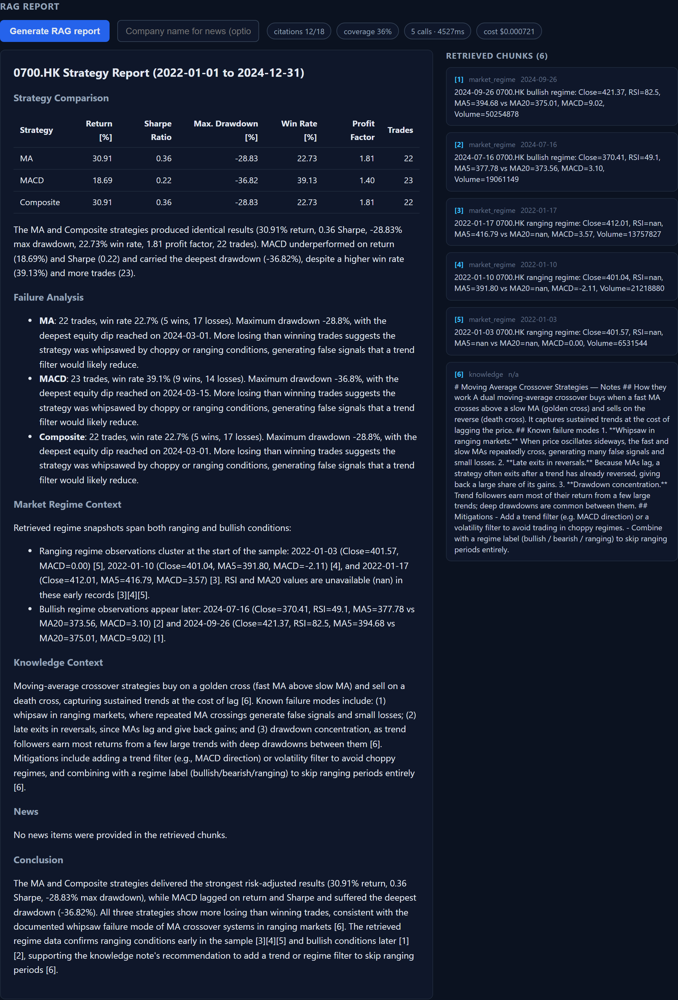
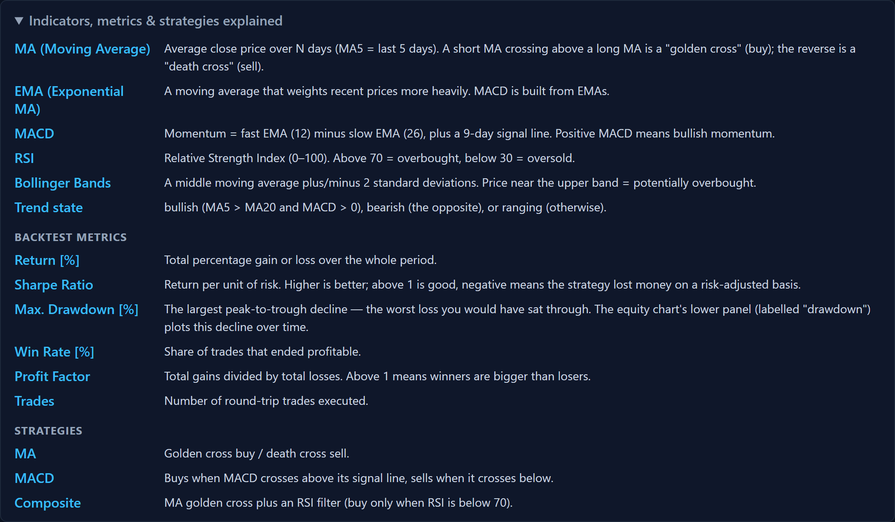

# Stock Trend

Systematic historical trend review and strategy backtesting for individual stocks.

> This project does **not** predict future prices. It engineers a reproducible
> pipeline to replay historical trends, backtest technical-indicator strategies,
> and evaluate their performance honestly — including failure analysis.

## Screenshots

**Dashboard** — candlestick + indicators, equity & drawdown, strategy comparison, and failure analysis:



**RAG report** — LLM-generated, citation-verified analysis with the retrieved evidence chunks:



**Glossary** — indicators, metrics, and strategies explained:



> Screenshots are captured headlessly with Playwright. Regenerate with
> `node frontend/scripts/capture-screenshots.mjs` (backend and frontend must be running).

## Tech Stack

- Python 3.10+
- [`yfinance`](https://github.com/ranaroussi/yfinance) — market data
- `pandas` / `numpy` — data processing
- [`backtesting.py`](https://github.com/kernc/backtesting.py) — event-driven backtesting
- `matplotlib` — visualization
- `pyarrow` — parquet cache
- `pytest` — tests
- Optional (`requirements-optional.txt`): `chromadb`, `rank-bm25`,
  `sentence-transformers`, `openai` — RAG retrieval, reranking, and LLM reports

## Quick Start

```bash
pip install -r requirements.txt
python -m pytest
python -m src.cli --ticker 0700.HK --start 2022-01-01 --end 2024-12-31 --output outputs/reports/0700.HK.md
```

The CLI downloads live data (requires internet). `python -m pytest` runs fully
offline and validates the core modules.

## Web App (React + FastAPI)

A full-stack dashboard: a React (Vite + TypeScript) frontend with TradingView
`lightweight-charts` candlesticks and ECharts equity/drawdown panels, backed by
a FastAPI JSON API.

```bash
# Terminal 1 — backend (project root)
pip install -r requirements.txt -r requirements-app.txt
uvicorn src.api.main:app --reload

# Terminal 2 — frontend
cd frontend
npm install
npm run dev
```

Open http://localhost:5173 — the Vite dev server proxies `/api` to the backend
on port 8000.

Set `DEEPSEEK_API_KEY` (or `OPENAI_API_KEY`) in a `.env` file (see
`.env.example`) to switch the RAG report from the offline template to
LLM-generated text with citation verification; without a key it falls back to
the deterministic template. Embeddings use a local sentence-transformers model
by default (install with `requirements-optional.txt`).

## Project Structure

```
stock-trend-lab/
├── src/
│   ├── data_loader.py      # data fetch + parquet cache + cleaning
│   ├── indicators.py       # MA / MACD / RSI / Bollinger / trend state
│   ├── strategy.py         # MA / MACD / Composite strategies
│   ├── backtest.py         # run + batch backtests
│   ├── evaluate.py         # strategy comparison + failure analysis
│   ├── report.py           # Markdown report generation
│   ├── cli.py              # end-to-end backtest entry point
│   ├── rag/                # hybrid retrieval, reranker, citation, indexers
│   ├── agent/              # planner/executor/retry orchestration + tools
│   ├── observability/      # cost & latency UsageTracker
│   └── api/                # FastAPI REST API (React backend)
├── config/
│   └── pricing.json        # LLM/embedding pricing table (config-driven)
├── frontend/               # React + Vite + TypeScript dashboard
├── tests/                  # pytest suite
├── notebooks/              # exploratory analysis
├── knowledge/              # documents for the RAG knowledge base
├── outputs/                # cached data, vector store, reports (gitignored)
└── requirements*.txt
```

## Evaluation Results

A real, reproducible run (no fabricated numbers):

- Ticker `0700.HK` (Tencent), 2022-01-01 to 2024-12-31 (734 trading days)
- Initial cash $100,000, commission 0.1%, open trades finalized at period end

Reproduce with:

```bash
python -m src.cli --ticker 0700.HK --start 2022-01-01 --end 2024-12-31
```

| Strategy | Return [%] | Sharpe Ratio | Max. Drawdown [%] | Win Rate [%] | Profit Factor | Trades |
|---|---|---|---|---|---|---|
| MA | 30.91 | 0.36 | -28.83 | 22.73 | 1.81 | 22 |
| MACD | 18.69 | 0.22 | -36.82 | 39.13 | 1.40 | 23 |
| Composite | 30.91 | 0.36 | -28.83 | 22.73 | 1.81 | 22 |

## Failure Analysis

Honest findings from the same run:

- **Low win rate, positive profit factor.** MA wins only ~23% of trades yet ends
  profitable, because winners are much larger than losers — a classic
  trend-following profile. This is *not* a robustness guarantee: a handful of
  big trends carried the result, so the strategy is fragile in a trendless market.
- **The Composite strategy is identical to MA here.** The RSI < 70 entry filter
  was non-binding: on this ticker/period no golden cross coincided with an
  overbought reading, so the added condition provided zero value. Worth testing
  on other assets before calling it a real improvement.
- **MACD underperforms.** Lower return, lower Sharpe, and a deeper -36.8%
  drawdown than MA despite a higher win rate — its wins are too small to offset
  the whipsaws.
- `evaluate.analyze_failures` surfaces each of these automatically instead of
  hiding underperforming periods.

## Implemented

- Hybrid retrieval (dense + BM25) fused with Reciprocal Rank Fusion
- Cross-encoder reranking with an offline heuristic fallback
- Citation verification (existence, support score, coverage)
- AI agent workflow (planning + tool calling + transient-retry)
- Cost & latency observability for every model/tool call (config-driven pricing)
- End-to-end RAG report endpoint (`/api/report`) + React dashboard
- News event recall (GDELT) + knowledge-base retrieval to ground the report
- LLM report generation (DeepSeek / OpenAI auto-switch, template fallback)
- Semantic embeddings (sentence-transformers local / OpenAI auto-detect)
- Walk-forward / out-of-sample evaluation, parameter optimization, Monte Carlo

## Remaining / Next

- Expand `knowledge/` with more strategy/regime documents
- Walk-forward with re-optimization (avoids look-ahead in parameter selection)
